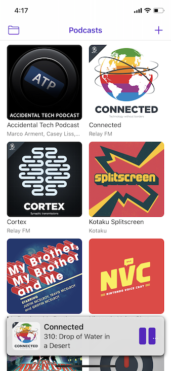

## Simple Swift Podcast Player

I made a simple podcast player in Swift. App can search iTunes' repository of podcasts, view available episodes in a podcast's feed, download, and play an episode.

App uses:
- [AlamoFire](https://github.com/Alamofire/Alamofire)
- [Realm](https://www.realm.io/products/realm-database/)
- [SDWebImage](https://github.com/rs/SDWebImage)
- [Feedkit](https://github.com/nmdias/FeedKit)